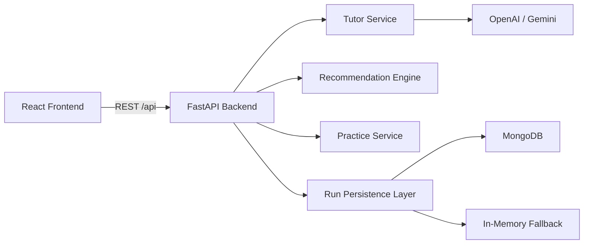
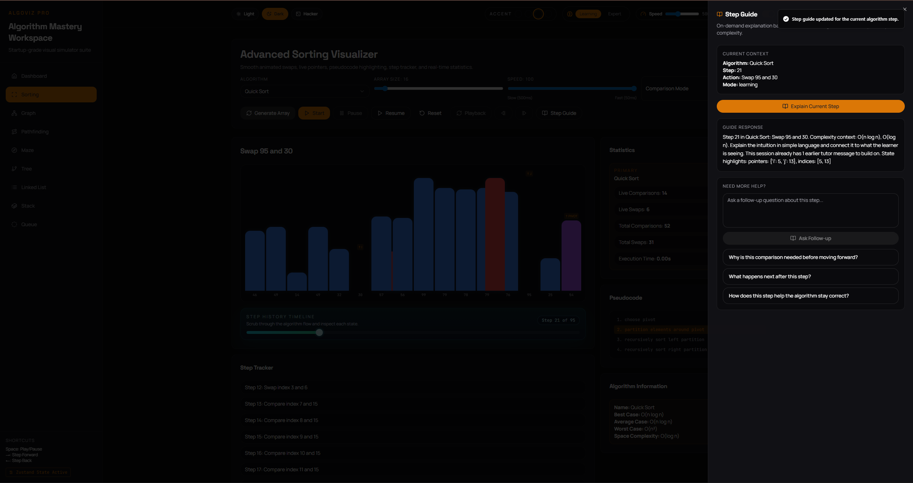

# 🚀 AlgoViz Pro (DSA Visualizer)

<p align="center">
  <strong>A full-stack interactive platform for learning data structures and algorithms through polished visual simulations, guided explanations, and hands-on experimentation.</strong>
</p>

<p align="center">
  Built to feel like a real product, not a classroom demo.
</p>

<p align="center">
  <a href="https://dsa-visualizer-xi-nine.vercel.app/">Live Demo</a>
  |
  <a href="#features">Features</a>
  |
  <a href="#modules">Modules</a>
  |
  <a href="#screenshots">Screenshots</a>
  |
  <a href="#how-to-run-locally">Run Locally</a>
</p>

<p align="center">
  
  
  
  
  
  
  
  
</p>

## ✨ Tagline
AlgoViz Pro transforms DSA learning into a visual, interactive, and measurable experience with real-time animations, algorithm walkthroughs, analytics, and custom data-structure builders.

## 🎥 Demo
**Live application:** [https://dsa-visualizer-xi-nine.vercel.app/](https://dsa-visualizer-xi-nine.vercel.app/)

**Why this project stands out**
- Real-time algorithm visualization with polished motion and state transitions
- Learning-first UX with step tracking, pseudocode highlighting, and output panels
- Full-stack architecture with backend APIs for recommendations, practice, saved runs, and guided explanations
- Product-style dashboard that makes the project feel deployment-ready and recruiter-friendly

## 🌟 Features
### Learning Experience
- Real-time algorithm visualization with smooth, pro-level animations
- Step-by-step execution to understand each decision an algorithm makes
- Pseudocode highlighting synchronized with the current execution state
- Practice mode with MCQs to reinforce concepts
- Complexity simulator for building performance intuition

### Interactivity
- Build your own graph, tree, linked list, stack, and queue directly in the UI
- Change inputs, rerun algorithms, and observe behavior live
- Interactive execution flows designed for experimentation, not static viewing
- Theme support with `dark`, `light`, and `hacker` modes

### Product Features
- Dashboard with activity, progress, and analytics
- Algorithm recommendation system based on scenario inputs
- Statistics tracking such as comparisons, swaps, and visited nodes
- AI-powered step guide with provider-based tutor support and fallback logic
- Saved run support with share tokens for replayable sessions

## 🧩 Modules
### Sorting Visualizer
Compare sorting algorithms with animated transitions, live metrics, step tracking, and pseudocode support. Designed to make runtime behavior intuitive, not just theoretical.

### Pathfinding Visualizer
Explore grid-based pathfinding with **BFS**, **DFS**, **Dijkstra**, and **A\***. Great for understanding search strategy, frontier expansion, and shortest-path behavior.

### Maze Generator
Generate procedural mazes using **Recursive Backtracking**, **Prim's Algorithm**, and **Recursive Division**, then pair them with pathfinding experiments.

### Graph Visualizer
Create and manipulate graphs interactively, then run graph algorithms in a state-aware environment built for debugging and exploration.

### Tree Visualizer
Work with manual trees, BST flows, DFS, BFS, and advanced structural operations in a visual environment that makes node relationships easier to understand.

### Linked List Visualizer
Visualize insertions, deletions, reversals, traversals, and cycle-oriented behavior with animations that make pointer logic easier to follow.

### Stack and Queue Visualizer
Practice **LIFO** and **FIFO** operations through clear structure transitions and guided interactions.

## 🛠️ Tech Stack
| Layer | Technologies |
| --- | --- |
| Frontend | React 18, React Router, CRACO, Tailwind CSS |
| UI / Motion | Radix UI, Framer Motion, Lucide React, Recharts |
| Visualization | D3, XYFlow, custom interactive visual components |
| State / Networking | Zustand, Axios |
| Backend | FastAPI, Uvicorn, Pydantic |
| Persistence | MongoDB via Motor with in-memory fallback |
| AI Integration | OpenAI or Gemini tutor provider support |
| Deployment | Vercel |
| Testing | Pytest, frontend test setup through CRACO |

## 🏗️ Architecture Overview
AlgoViz Pro uses a full-stack architecture where the React frontend handles rendering, motion, learner interaction, and module workflows, while the FastAPI backend powers guided explanations, recommendations, run persistence, practice questions, and deployment-ready APIs.



### Project Structure
- `frontend/` contains the React application, pages, UI components, modules, analytics, and visualization logic.
- `backend/` contains the FastAPI server, tutor service, persistence layer, and backend tests.
- `build.py` builds the frontend and prepares static assets for deployment.
- `app.py` exposes the production FastAPI entrypoint.

## 📸 Screenshots
<p align="center">
  
</p>

<p align="center">
  
  
</p>

<p align="center">
  
  
</p>

<p align="center">
  
</p>

<p align="center">
  
  
  
</p>

## ⚙️ How To Run Locally
### 1. Clone the repository
```bash
git clone https://github.com/nikhil22321/DSA-visualizer.git
cd DSA-visualizer
```

### 2. Set up and run the backend
```bash
cd backend
python -m venv venv
venv\Scripts\activate
pip install -r requirements.txt
copy .env.example .env
uvicorn server:app --reload --host 127.0.0.1 --port 8001
```

### 3. Configure the frontend
Create `frontend/.env.local` with:

```env
REACT_APP_BACKEND_URL=http://127.0.0.1:8001
```

### 4. Run the frontend
```bash
cd frontend
npm install
npm start
```

### 5. Open the app
- Frontend: `http://localhost:3000`
- Backend health endpoint: `http://127.0.0.1:8001/api/health`

### Optional configuration
- If `MongoDB` is configured in `backend/.env`, saved runs and tutor history will persist.
- If MongoDB is not configured, the backend automatically falls back to in-memory storage.
- If `OPENAI_API_KEY` or `GEMINI_API_KEY` is configured, the guided explanation service can use AI-generated tutoring responses.

### Run tests
```bash
cd backend
pytest

cd ../frontend
npm test
```

## 🚀 Future Improvements
- Add more advanced graph and tree algorithms
- Expand side-by-side algorithm comparison workflows
- Add authentication and persistent learner profiles
- Support saved dashboards and richer run history insights
- Improve mobile-first usability and responsiveness
- Add export and sharing workflows for classrooms and interview prep

## 🤝 Contributing
Contributions are welcome if you want to improve the UI, add algorithms, refine animations, strengthen tests, or polish the overall product experience.

### Suggested workflow
```bash
git checkout -b feature/your-feature-name
git commit -m "Add your feature"
git push origin feature/your-feature-name
```

Then open a pull request with a concise summary and screenshots if your changes affect the UI.

## 👨‍💻 Author
**Nikhil**

- GitHub: [@nikhil22321](https://github.com/nikhil22321)
- Live Demo: [AlgoViz Pro](https://dsa-visualizer-xi-nine.vercel.app/)

---

<p align="center">
  <strong>If you like the project, consider giving it a star.</strong>
</p>
