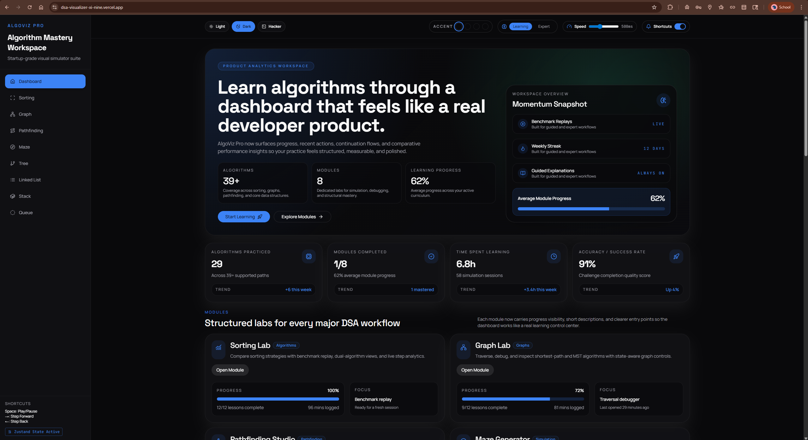
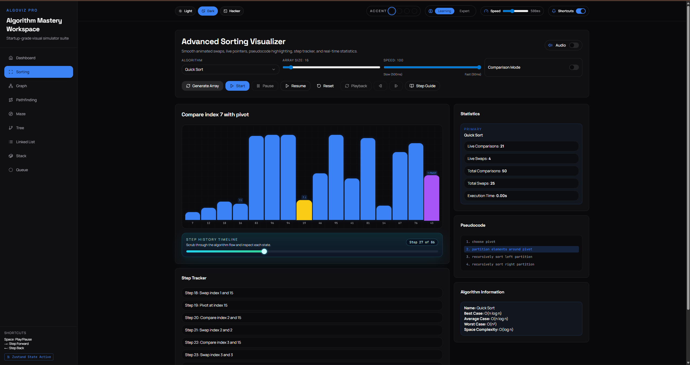
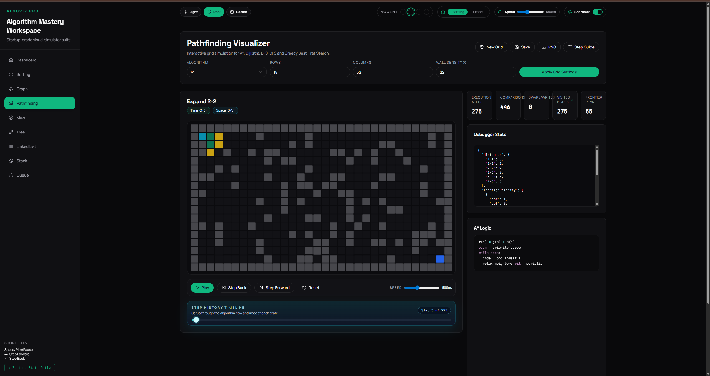
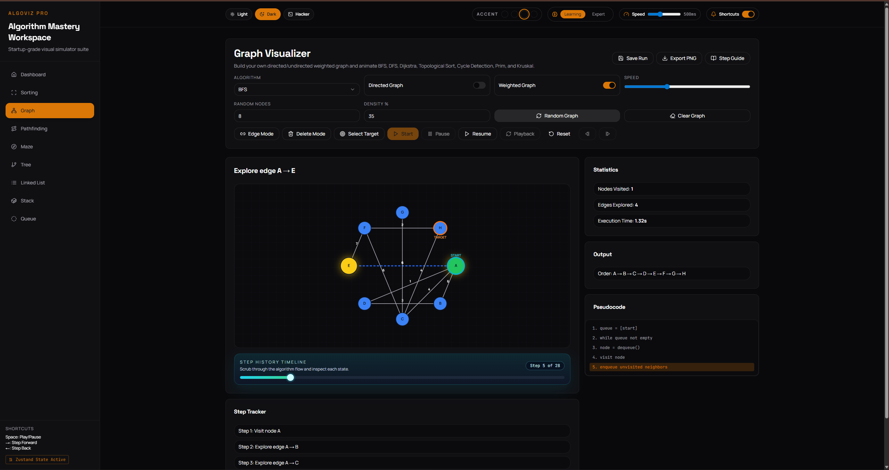
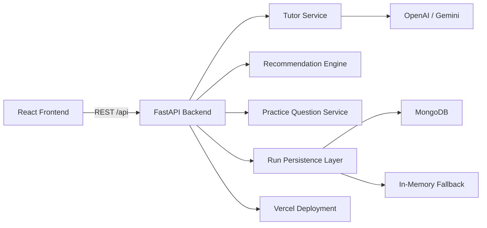
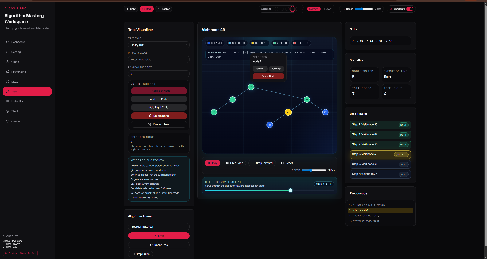
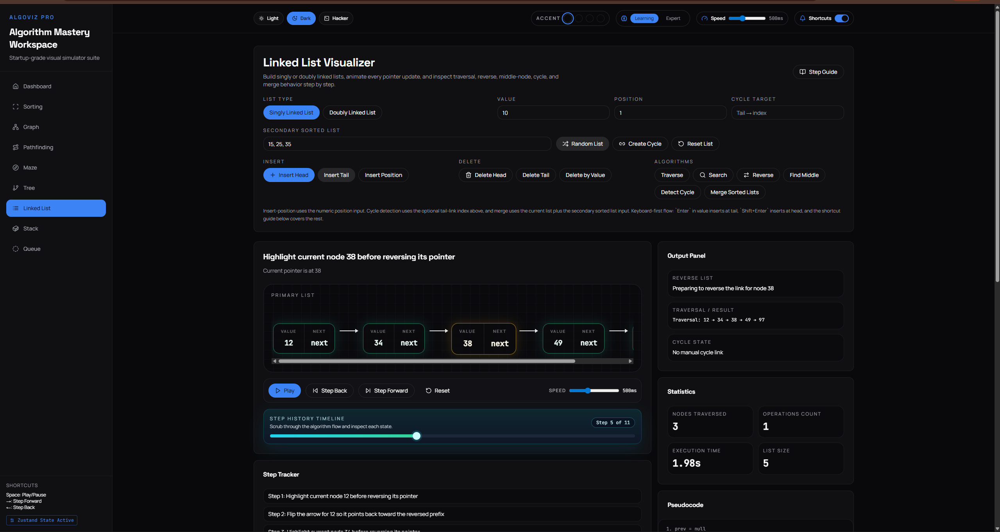
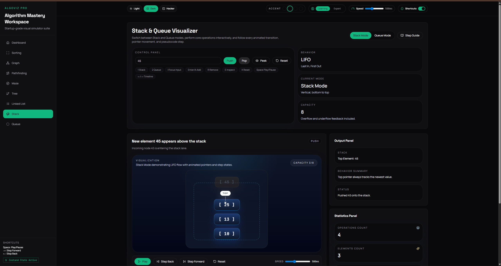
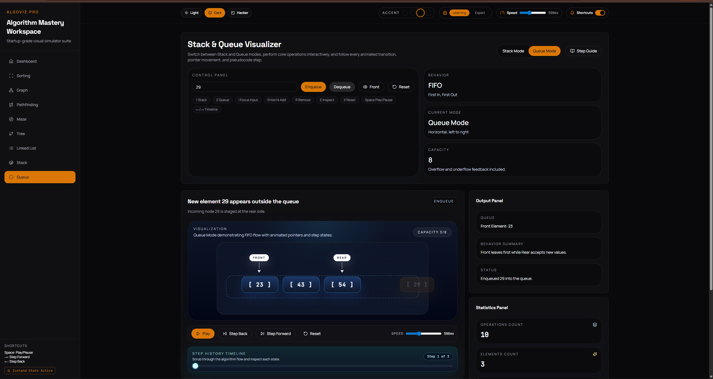

# 🚀 AlgoViz Pro (DSA Visualizer)

<p align="center">
  <strong>A full-stack algorithm learning platform that turns data structures and algorithms into an interactive, product-grade visual experience.</strong>
</p>

<p align="center">
  Built for students, recruiters, and engineers who want more than static demos: real-time simulations, guided explanations, analytics, and hands-on experimentation in one polished workspace.
</p>

<p align="center">
  <a href="https://dsa-visualizer-xi-nine.vercel.app/">Live Demo</a>
  ·
  <a href="#-features">Features</a>
  ·
  <a href="#-how-to-run-locally">Run Locally</a>
  ·
  <a href="#-contributing">Contributing</a>
</p>

<p align="center">
  
  
  
  
  
  
  
  
</p>

## ✨ Tagline
**AlgoViz Pro** is a modern DSA visualization platform that combines real-time algorithm playback, interactive data-structure builders, learning analytics, and guided explanations to make technical concepts feel intuitive, visual, and memorable.

## 🎥 Demo
**Live product:** [dsa-visualizer-xi-nine.vercel.app](https://dsa-visualizer-xi-nine.vercel.app/)

<!-- **Suggested media slots for GitHub:**

```md




``` -->

**Demo ideas to showcase:**
- Dashboard overview with analytics and module progress
- Sorting animation with pseudocode highlighting and live stats
- Pathfinding run comparing BFS, DFS, Dijkstra, and A*
- Graph or tree builder with user-created structures

## 🌟 Features
### Learning Experience
- Real-time algorithm visualization with smooth, high-clarity animations
- Step-by-step execution for understanding algorithm flow instead of just the final answer
- Pseudocode highlighting synchronized with runtime behavior
- Practice mode with MCQs for concept reinforcement
- Built-in complexity simulator for intuition around performance trade-offs

### Interactivity
- Build your own graph, tree, linked list, stack, or queue directly in the UI
- Adjustable inputs and algorithm controls for experimentation
- Replay-friendly execution flows and structured run data
- Theme support including `dark`, `light`, and `hacker` modes

### Product-Level Additions
- Dashboard with progress, activity, and learning analytics
- Algorithm recommendation system based on input scenario
- Statistics tracking such as comparisons, swaps, visited nodes, and execution flow
- AI-powered step guide with fallback tutor behavior for guided explanations
- Saved run API and share-token support for replayable sessions

## 🧩 Modules Breakdown
### Sorting Visualizer
- Compare sorting strategies with animated transitions, live statistics, step tracking, and pseudocode-driven learning.
- Great for understanding algorithm behavior beyond time complexity alone.

### Pathfinding Visualizer
- Explore grid-based traversal and shortest-path algorithms including **BFS**, **DFS**, **Dijkstra**, and **A\***.
- Designed to make frontier expansion, visited states, and path construction visually intuitive.

### Maze Generator
- Generate procedural mazes using **Recursive Backtracking**, **Prim's Algorithm**, and **Recursive Division**.
- Ideal for pairing generation logic with pathfinding experiments.

### Graph Visualizer
- Create graphs interactively and inspect traversal or shortest-path behavior with state-aware controls.
- Built for experimentation, debugging, and algorithm intuition.

### Tree Visualizer
- Visualize tree operations through manual construction, BST interactions, and traversal workflows like **DFS** and **BFS**.
- Useful for learning structural properties and navigation logic.

### Linked List Visualizer
- Perform insertions, deletions, reversals, traversal, and cycle-detection style operations with animated node updates.
- Helps demystify pointers and sequence manipulation.

### Stack & Queue Visualizer
- Practice **LIFO** and **FIFO** operations with clear state transitions and animated execution feedback.
- Simple enough for beginners, polished enough to feel like a real product module.

## 🛠️ Tech Stack
| Layer | Technology |
| --- | --- |
| Frontend | React 18, React Router, CRACO, Tailwind CSS |
| UI / Motion | Radix UI, Framer Motion, Lucide Icons, Recharts |
| Visualization | D3, XYFlow, custom interactive components |
| State / Data | Zustand, Axios |
| Backend | FastAPI, Uvicorn, Pydantic |
| Database | MongoDB via Motor with in-memory fallback |
| AI Tutor | OpenAI or Gemini API integration with heuristic fallback |
| Deployment | Vercel |
| Testing | Pytest, frontend test setup via CRACO |

## 🏗️ Architecture Overview
AlgoViz Pro follows a clean full-stack architecture where the React frontend handles rendering, animation, and learner interaction, while the FastAPI backend provides API endpoints for guided explanations, saved runs, recommendations, practice questions, and health/status services.



### High-level structure
- `frontend/` contains the React application, UI system, pages, modules, motion, analytics, and visualization logic.
- `backend/` contains the FastAPI server, API models, tutor service, persistence layer, and backend tests.
- `build.py` builds the frontend and prepares static assets for deployment.
- `app.py` exposes the production app entrypoint for the deployed FastAPI service.

<!-- ## 📸 Screenshots -->
Replace the placeholders below with your final product images before publishing widely.

```md
<!-- 





 -->

## 📸 Screenshots

### Dashboard


---

### Sorting Visualizer


### Pathfinding Visualizer


---

### Graph Visualizer


### Tree Visualizer


---

### Linked List


### Stack


### Queue


## ⚙️ How To Run Locally
### 1. Clone the repository
```bash
git clone https://github.com/nikhil22321/DSA-visualizer.git
cd DSA-visualizer
```

### 2. Start the backend
```bash
cd backend
python -m venv venv
venv\Scripts\activate
pip install -r requirements.txt
copy .env.example .env
uvicorn server:app --reload --host 127.0.0.1 --port 8001
```

### 3. Configure the frontend
Create `frontend/.env.local` and point it to the backend:

```env
REACT_APP_BACKEND_URL=http://127.0.0.1:8001
```

### 4. Start the frontend
```bash
cd frontend
npm install
npm start
```

### 5. Open the app
- Frontend: `http://localhost:3000`
- Backend health check: `http://127.0.0.1:8001/api/health`

### Optional services
- If `MongoDB` is configured in `backend/.env`, saved runs and tutor history persist to the database.
- If no database is configured, the backend falls back to in-memory storage.
- If `OPENAI_API_KEY` or `GEMINI_API_KEY` is configured, the step guide can return AI-generated explanations.

### Test commands
```bash
# Backend
cd backend
pytest

# Frontend
cd frontend
npm test
```

## 🚀 Future Improvements
- Add side-by-side algorithm comparison mode across more modules
- Expand tree and graph coverage with more advanced algorithms and edge cases
- Add user authentication and saved learner profiles
- Introduce collaborative classrooms or shareable public sessions
- Add benchmark export, run history dashboards, and richer performance reports
- Improve mobile-first interactions for smaller screens

## 🤝 Contributing
Contributions, ideas, and improvements are welcome.

### Ways to contribute
- Report bugs or UX issues
- Suggest new algorithms or visual modules
- Improve animations, accessibility, or performance
- Add tests, documentation, or developer tooling

### Contribution flow
```bash
git checkout -b feature/your-feature-name
git commit -m "Add your feature"
git push origin feature/your-feature-name
```

Then open a pull request with a clear summary of the improvement and screenshots if the change affects the UI.

## 👨‍💻 Author
**Nikhil**

- GitHub: [@nikhil22321](https://github.com/nikhil22321)
- Project: [AlgoViz Pro Live Demo](https://dsa-visualizer-xi-nine.vercel.app/)

---

<p align="center">
  <strong>If you like the project, consider giving it a star and sharing feedback.</strong>
</p>
